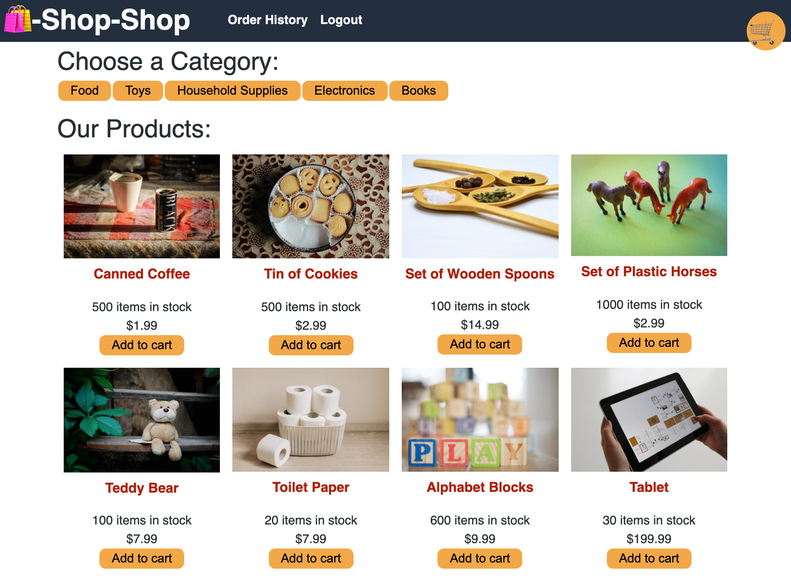
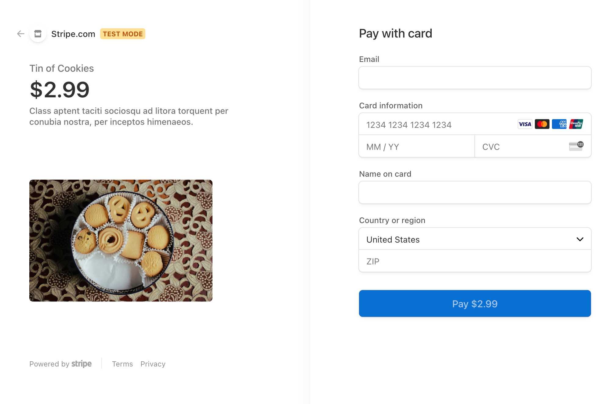

# Book Search Engine

## Description 
This full stack javascript web application refactored an online shopping webapp to take advantage of Redux functionality. This is a MERN stack application using (M) MongoDB, (E) Express.js, (R) React, and (N) Node.js. 

The refactored application uses Node.js and Concurrently to manage dependencies and run both the server side and client side of the application. The back end uses GraphQL, MongoDB,Express, and Apollo to connect to the front end, which uses the React, Express,  with bootstrap for styling.

This application is deployed on [Heroku](https://thawing-plains-43376.herokuapp.com/).

## Table of Contents
* [Installation](#installation)
* [Preview](#Preview)
* [User Story](#user)
* [License](#license)
* [Contributing](#contributing)
* [Tests](#tests)
* [Questions](#questions)

## Installation 
 Create a local clone of the github repository on your workstation by entering the following command in your Command Line Interface (CLI -- such as Terminal or Bash):
 - git clone git@github.com:hlry/shop-shop.git

Install dependencies
 Run `npm i` at the root level of the application to install dependencies.
 For development or testing purposes, navigate into the client and server directories ("cd client" "cd .." "cd server" "cd .."). There are gitignore files in the root, in the server, and in the client to ensure that the node modules are not wasting space getting synced to GitHub. Make sure you are in the root when you push to your own GitHub, if you are doing so.

 Install MongoDB on your local computer. If you are developing this application for personal or educational purposes, you may be eligible for a gratis personal MongoAtlas instance (please refer to MongoDB's terms on its site).

To run the client and server at the same time, thanks to Concurrently.js you may simply enter the command `npm run start` from the root.

Root dependencies:
- if-env
- concurrently (dev dependency)

Client-side dependencies:
- apollo/react-hooks
- apollo-boost
- bootstrap
- express
- graphql
- graphql-tag
- jwt-decode
- react
- react-bootstrap
- react-dom
- react-router-dom
- react-scripts
- redux

Server-side dependencies:
- apollo-server-express
- bcrypt
- express
- graphql
- jsonwebtoken
- mongoose
- nodemon (dev dependency)

## Preview
E-commerce Shopping View

Checkout View

## User
AS a senior engineer working on an e-commerce platform
I WANT my platform to use Redux to manage global state instead of the Context API
SO THAT my website's state management is taken out of the React ecosystem

GIVEN an e-commerce platform that uses Redux to manage global state
WHEN I review the app’s store
THEN I find that the app uses a Redux store instead of the Context API
WHEN I review the way the React front end accesses the store
THEN I find that the app uses a Redux provider
WHEN I review the way the app determines changes to its global state
THEN I find that the app passes reducers to a Redux store instead of using the Context API
WHEN I review the way the app extracts state data from the store
THEN I find that the app uses Redux instead of the Context API
WHEN I review the way the app dispatches actions
THEN I find that the app uses Redux instead of the Context API

## License 
This project is license under the ISC license.

## Contributing 
Made by HLRY. This project is not currently accepting contributions.

## Tests
There are no tests for this application. 

## Questions
For any questions about the project/repository please contact me on GitHub @ [HLRY](https://github.com/hlry) 